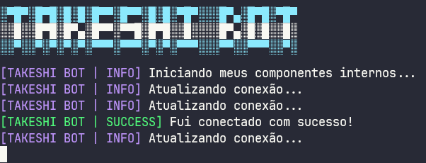
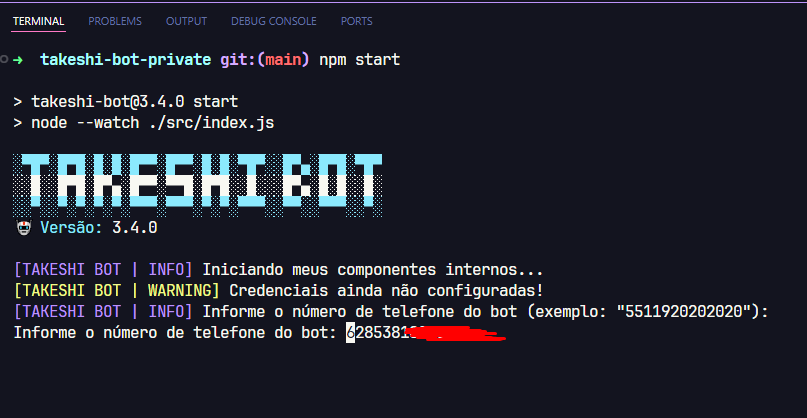
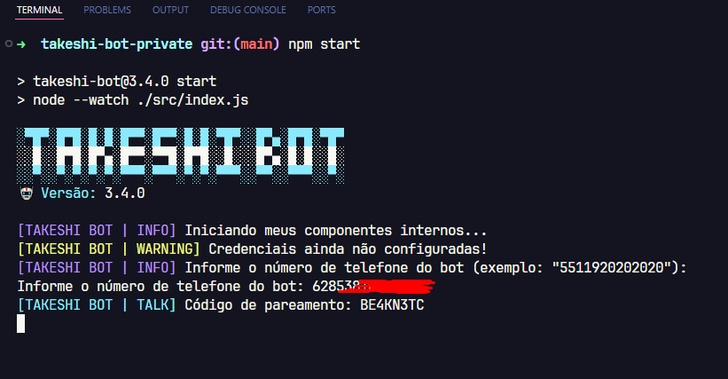
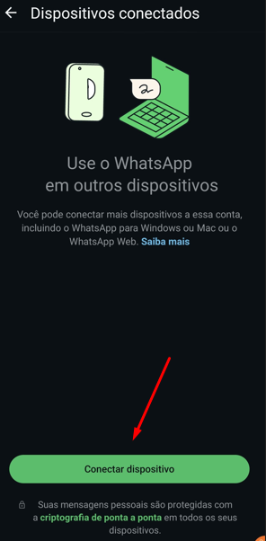
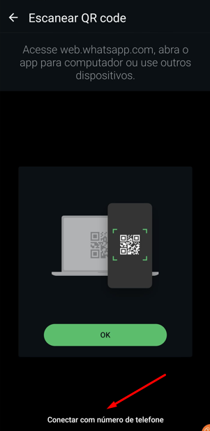
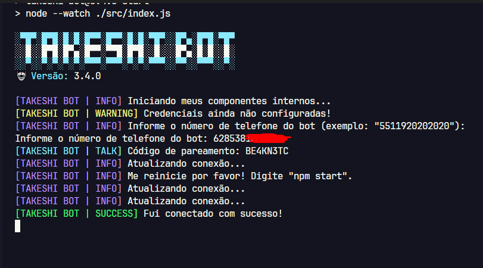
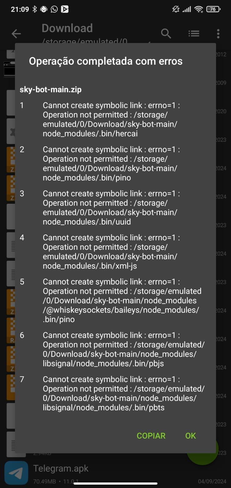
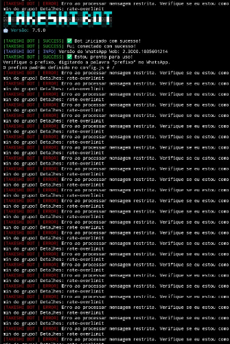

# 🤖 bot_marc


[](https://nodejs.org/en)
[](https://github.com/WhiskeySockets/Baileys)
[](https://ffmpeg.org/)
[](https://api.spiderx.com.br)

> Base para bots de WhatsApp multifuncional com diversos comandos prontos.



## 📋 Sumário

1. [Atenção](#-atenção)
2. [Sobre o Projeto](#sobre-este-projeto)
3. [Instalação](#instalação-no-termux)
    - [No Termux](#instalação-no-termux)
    - [No Windows](#instalação-no-windows)
    - [Em VPS (Debian/Ubuntu)](#instalação-em-vps-debianubuntu)
4. [Diagrama de conexão](#diagrama-de-conexão)
5. [Alguns comandos necessitam de API](#alguns-comandos-necessitam-de-api)
6. [Funcionalidades gerais](#funcionalidades-gerais)
7. [Auto responder](#auto-responder)
8. [Menu do bot](#onde-fica-o-menu-do-bot)
9. [Mensagens de boas vindas](#onde-modifico-a-mensagem-de-boas-vindas-e-quando-alguém-sai-do-grupo)
10. [Diagrama de como os comandos funcionam](#diagrama-de-como-os-comandos-funcionam)
11. [Diagrama de como funcionam os middlewares](#diagrama-de-como-funcionam-os-middlewares-interceptadores-de-recepção-e-saída)
12. [Custom Middleware](#custom-middleware---personalize-o-bot-sem-modificar-arquivos-principais)
13. [Estrutura de pastas](#estrutura-de-pastas)
14. [Atualizar o bot](#atualizar-o-bot)
15. [Testes](#testes)
16. [Erros comuns](#erros-comuns)
17. [Contribuindo com o projeto](#contribuindo-com-o-projeto)
18. [Licença](#licença)

## ⚠ Atenção

Nós não prestamos suporte gratuíto caso você tenha adquirido esta base com terceiros e tenha pago por isso.
Este bot sempre foi e sempre será **gratuíto**.
Caso você tenha pago para utilizar este bot, do jeito que ele está hoje, saiba que você **foi enganado**.
Nós não temos vínculo nenhum com terceiros e não nos responsabilizamos por isso, também não prestamos suporte nessas condições.
Os únicos recursos pagos deste bot são pertencentes à [https://api.spiderx.com.br](https://api.spiderx.com.br), nossa API oficial.

## Sobre este projeto

Este projeto não possui qualquer vínculo oficial com o WhatsApp. Ele foi desenvolvido de forma independente para interações automatizadas por meio da plataforma.

Não nos responsabilizamos por qualquer uso indevido deste bot. É de responsabilidade exclusiva do usuário garantir que sua utilização esteja em conformidade com os termos de uso do WhatsApp e a legislação vigente.

## Instalação no Termux

1 - Abra o Termux e execute os comandos abaixo.
_Não tem o Termux? [Clique aqui e baixe a última versão](https://www.mediafire.com/file/wxpygdb9bcb5npb/Termux_0.118.3_Dev_Gui.apk) ou [clique aqui e baixe versão da Play Store](https://play.google.com/store/apps/details?id=com.termux) caso a versão do MediaFire anterior não funcione._

```sh
pkg upgrade -y && pkg update -y && pkg install git -y && pkg install nodejs-lts -y && pkg install ffmpeg -y
```

2 - Habilite o acesso da pasta storage, no termux.

```sh
termux-setup-storage
```

3 - Escolha uma pasta de sua preferência pra colocar os arquivos do bot.

Pastas mais utilizadas:

- /sdcard
- ~/storage/emulated/0
- ~/storage/emulated/0/Download (muito comum quando você baixa o bot pelo .zip)

No nosso exemplo, vamos para a `~/storage`

```sh
cd ~/storage
```

4 - Clone o repositório.

```sh
git clone https://github.com/bot_marc/bot_marc.git
```

5 - Entre na pasta que foi clonada.

```sh
cd bot_marc
```

6 - Habilite permissões de leitura e escrita (faça apenas 1x esse passo).

```sh
chmod -R 755 ./*
```

7 - Instale as dependências do projeto.

Se você escolheu uma pasta de armazenamento compartilhado (como `/sdcard`, `~/storage/emulated/0` ou a pasta `Download`), use a flag `--no-bin-links`, pois esse tipo de armazenamento não suporta links simbólicos e o `npm install` normal vai falhar:

```sh
npm install --no-bin-links
```

Se você usou uma pasta interna do Termux (fora da `~/storage`), pode instalar normalmente:

```sh
npm install
```

8 - Execute o bot.

```sh
npm start
```

9 - Insira o número de telefone e pressione `enter`.

10 - Informe o código que aparece no termux, no seu WhatsApp, [assista aqui, caso não encontre essa opção](https://youtu.be/6zr2NYIYIyc?t=5395).

11 - Aguarde 10 segundos, depois digite `CTRL + C` para parar o bot.

Depois, Configure o arquivo `config.js` que está dentro da pasta `src`.

```js
// Prefixo padrão dos comandos.
export const PREFIX = "/";

// Emoji do bot (mude se preferir).
export const BOT_EMOJI = "🤖";

// Nome do bot (mude se preferir).
export const BOT_NAME = "bot_marc";

// LID do bot (no caso, o que você rodará o bot).
// Para obter o LID do bot, use o comando <prefixo>lid respondendo em cima de uma mensagem do número do bot
// Troque o <prefixo> pelo prefixo do bot (ex: /lid).
export const BOT_LID = "12345678901234567890@lid";

// LID do dono do bot (no caso, o seu!).
// Para obter o LID do dono do bot, use o comando <prefixo>meu-lid
// Troque o <prefixo> pelo prefixo do bot (ex: /meu-lid).
export const OWNER_LID = "12345678901234567890@lid";
```

12 - Inicie o bot novamente.

```sh
npm start
```

## Instalação no Windows

1 - Abra o PowerShell como administrador.

Clique com o botão direito no menu iniciar, escolha `Terminal (Admin)` ou `Windows PowerShell (Admin)`.

2 - Instale o Git, Node.js 24.x.x ou superior e FFmpeg.

Se você usa Windows 10 ou Windows 11 com `winget`, execute:

```sh
winget install --id Git.Git -e
winget install --id OpenJS.NodeJS -e
winget install --id Gyan.FFmpeg -e
```

Se algum comando acima não funcionar, instale manualmente:

- Git: [https://git-scm.com/downloads/win](https://git-scm.com/downloads/win)
- Node.js 24.x.x ou superior: [https://nodejs.org/en](https://nodejs.org/en)
- FFmpeg: [https://ffmpeg.org/download.html](https://ffmpeg.org/download.html)

3 - Feche e abra o PowerShell novamente para atualizar o PATH.

4 - Verifique se o Node.js, npm, Git e FFmpeg foram instalados.

```sh
node -v
npm -v
git --version
ffmpeg -version
```

O comando `node -v` deve exibir uma versão `v24.x.x`.

5 - Escolha uma pasta para colocar os arquivos do bot.

No exemplo abaixo, vamos usar a Área de Trabalho:

```sh
cd $env:USERPROFILE\Desktop
```

6 - Clone o repositório.

```sh
git clone https://github.com/bot_marc/bot_marc.git
```

7 - Entre na pasta clonada.

```sh
cd bot_marc
```

8 - Instale as dependências.

```sh
npm install
```

9 - Execute o bot.

```sh
npm start
```

10 - O bot vai solicitar que você digite seu número de telefone.
Digite **exatamente** como está no WhatsApp e apenas números.

Não adicione o 9º dígito em números que não sejam de SP ou RJ.

11 - Informe o código de pareamento no WhatsApp.

No WhatsApp, vá em `dispositivos conectados`, clique em `conectar dispositivo` e depois em `Conectar com número de telefone`.

12 - Aguarde a conexão e digite `CTRL + C` no PowerShell para parar o bot.

Depois, configure o arquivo `config.js` que está dentro da pasta `src`.

13 - Inicie o bot novamente.

```sh
npm start
```

## Instalação em VPS (Debian/Ubuntu)

1 - Abra um novo terminal e execute os seguintes comandos.

```sh
sudo apt update && sudo apt upgrade && sudo apt-get update && sudo apt-get upgrade && sudo apt install ffmpeg
```

2 - Instale o `curl` se não tiver.

```sh
sudo apt install curl
```

3 - Instale o `git` se não tiver.

```sh
sudo apt install git
```

4 - Instale o NVM.

```sh
curl -o- https://raw.githubusercontent.com/nvm-sh/nvm/v0.40.3/install.sh | bash
```

5 - Atualize o source do seu ambiente

```sh
source ~/.bashrc
```

6 - Instale a versão 24 mais recente do node.js.

```sh
nvm install 24
```

7 - Verifique se a versão foi instalada e está ativa.

```sh
node -v # Deve exibir a versão 24
```

8 - Verifique se o npm foi instalado junto.

```sh
npm -v # Deverá exibir a versão do npm
```

9 - Instale o PM2 (recomendado).

```sh
npm install pm2 -g
```

10 - Clone o repositório do bot onde você desejar.

```sh
git clone https://github.com/bot_marc/bot_marc.git
```

11 - Entre na pasta clonada.

```sh
cd bot_marc
```

12 - Instale as dependências do projeto.

```sh
npm install
```

13 - Digite o seguinte comando.

```sh
npm start
```

14 - O bot vai solicitar que você digite seu número de telefone.
Digite **exatamente** como está no WhatsApp e apenas números.

Não adicione o 9º dígito em números que não sejam de SP ou RJ.



15 - Conecte o bot no PM2

```sh
pm2 start npm --name "bot_marc" -- start
```

16 - O bot exibirá um **código de pareamento** que deve ser colocado em `dispositivos conectados` no seu WhatsApp.



17 - Vá em `dispositivos conectados` no seu WhatsApp.


18 - Clique em `conectar dispositivo`



19 - No canto inferior, clique em `Conectar com número de telefone`



20 - Coloque o **código de pareamento** que você recebeu no terminal, que foi feito no passo `16`.


21 - Após isso, no terminal que ficou parado, ele deve exibir que **foi conectado com sucesso**



22 - Digite `CTRL + C` para parar o bot.

23 - Agora inicie ele pelo `PM2`, executando o seguinte código abaixo.

```sh
pm2 start npm --name "bot_marc" -- start
```


24 - Aguarde 10 segundos, depois digite `CTRL + C` para parar o bot.

Depois, Configure o arquivo `config.js` que está dentro da pasta `src`.

```js
// Prefixo padrão dos comandos.
export const PREFIX = "/";

// Emoji do bot (mude se preferir).
export const BOT_EMOJI = "🤖";

// Nome do bot (mude se preferir).
export const BOT_NAME = "bot_marc";

// LID do bot (no caso, o que você rodará o bot).
// Para obter o LID do bot, use o comando <prefixo>lid respondendo em cima de uma mensagem do número do bot
// Troque o <prefixo> pelo prefixo do bot (ex: /lid).
export const BOT_LID = "12345678901234567890@lid";

// LID do dono do bot (no caso, o seu!).
// Para obter o LID do dono do bot, use o comando <prefixo>meu-lid
// Troque o <prefixo> pelo prefixo do bot (ex: /meu-lid).
export const OWNER_LID = "12345678901234567890@lid";
```

Lembre-se de trocar os números acima pelos seus números, obviamente e tbm ver se o seu prefixo é a barra /.

25 - Por fim, teste o bot!


## Diagrama de conexão

[![diagram](https://mermaid.ink/img/pako:eNqdVc1u1DAQfpWpJSSQtqX7k_2JoChse-hh26qtWlTtxZtMs4bEXhxnVVpV4gDcOLQUDgipQnBAiBs3OO6b8AR9BMbJZvu3BYQPVmx_M558M9_4gPkqQOayBJ-mKH1cFDzUPO5KoMFTo2Qa91Dn6wHXRvhiwKWBRRwCT-Ds9OjLr-evz06Pf8KW8kdfryMfKpMjP7-DTf4Ek76we9eB216OO_4G231uEm8w6MoctqIMghqitveWtj2XYO-fQ1vFCtTEq68k-oaDVBMHDwoPt27B_cmAtfXlztLyugdbSzsX9nOoJiegw97tSnW-BJWanRznTn54UzSv3sKaFjEKzWGI-6BVwGVgo-sV_2rH-ReZzi4sEBEuyEEMiSEmzk9pn04J40KXLYpQ2BtBjn7EqBUEmVd7NNWf45TLrWJMuzv3bgNfwwDBH30PREhu0eYDeYzSqHP0tjdbeF5Ho7TkE4vbuOdCuVKtzTr1RvPO1PjPTk-OoKMSoyd2F2ymhXeJXxe8Hlmep9Sm18cojbi-19N3F7ZGHwFj4sKzwUd9lVBdZIUQqKTLMkw7ElTfOWx8qKHAjzETloufi7OYA3Vz9iyDvz68hPbYggpwV-iYbC4EeYnIMY82hr3RJ5VJTIt9HvCZq-RlwA0eDYk2TWmSvuAi-TNfmY2N6OHqJrRXV5bam97i6kz2f16oiEeMEIZ8opWcQhtFzEmIWeoREowHGvMLUAY3aWj05tFyx9uwIlra-IOMxgrKtPQXGZ28gBVqAgM9-r4nYvoiLWHyv_rJueZaY3iJREgsrck0QYyrA65QMlUNWeqLUpv5x8ysra-ubI5TYlvjY1u-iaFZyUhIzA4QeJhynbcQCiDhIU0XEgJTByuxUIuAuUanWGLUK2Jul-zAWnSZ6WOMXWYbR4C7PI2M7SCHZEYNeEepuLDUKg37zN3lUUKrdBBwUzwNk11NgaBuq1Qa5pZbzUrmhbkHbI_WzfpcrdGq1eabTtNpVSrVEnvG3Mb8XKPpVKpVakx1p1FvHpbYfnZvea5RL9drjfK8UynXW80Sw0CQNjr5-5Q9U4e_ARz-Fnw?type=png)](https://mermaid.live/edit#pako:eNqdVc1u1DAQfpWpJSSQtqX7k_2JoChse-hh26qtWlTtxZtMs4bEXhxnVVpV4gDcOLQUDgipQnBAiBs3OO6b8AR9BMbJZvu3BYQPVmx_M558M9_4gPkqQOayBJ-mKH1cFDzUPO5KoMFTo2Qa91Dn6wHXRvhiwKWBRRwCT-Ds9OjLr-evz06Pf8KW8kdfryMfKpMjP7-DTf4Ek76we9eB216OO_4G231uEm8w6MoctqIMghqitveWtj2XYO-fQ1vFCtTEq68k-oaDVBMHDwoPt27B_cmAtfXlztLyugdbSzsX9nOoJiegw97tSnW-BJWanRznTn54UzSv3sKaFjEKzWGI-6BVwGVgo-sV_2rH-ReZzi4sEBEuyEEMiSEmzk9pn04J40KXLYpQ2BtBjn7EqBUEmVd7NNWf45TLrWJMuzv3bgNfwwDBH30PREhu0eYDeYzSqHP0tjdbeF5Ho7TkE4vbuOdCuVKtzTr1RvPO1PjPTk-OoKMSoyd2F2ymhXeJXxe8Hlmep9Sm18cojbi-19N3F7ZGHwFj4sKzwUd9lVBdZIUQqKTLMkw7ElTfOWx8qKHAjzETloufi7OYA3Vz9iyDvz68hPbYggpwV-iYbC4EeYnIMY82hr3RJ5VJTIt9HvCZq-RlwA0eDYk2TWmSvuAi-TNfmY2N6OHqJrRXV5bam97i6kz2f16oiEeMEIZ8opWcQhtFzEmIWeoREowHGvMLUAY3aWj05tFyx9uwIlra-IOMxgrKtPQXGZ28gBVqAgM9-r4nYvoiLWHyv_rJueZaY3iJREgsrck0QYyrA65QMlUNWeqLUpv5x8ysra-ubI5TYlvjY1u-iaFZyUhIzA4QeJhynbcQCiDhIU0XEgJTByuxUIuAuUanWGLUK2Jul-zAWnSZ6WOMXWYbR4C7PI2M7SCHZEYNeEepuLDUKg37zN3lUUKrdBBwUzwNk11NgaBuq1Qa5pZbzUrmhbkHbI_WzfpcrdGq1eabTtNpVSrVEnvG3Mb8XKPpVKpVakx1p1FvHpbYfnZvea5RL9drjfK8UynXW80Sw0CQNjr5-5Q9U4e_ARz-Fnw)

## Alguns comandos necessitam de API

Edite o arquivo `config.js` que está dentro da pasta `src` e cole sua api key da plataforma Spider X API, conforme o código abaixo.
Para obter seu token, acesse: [https://api.spiderx.com.br](https://api.spiderx.com.br) e crie sua conta gratuitamente!

```js
export const SPIDER_API_TOKEN = "seu_token_aqui";
```

Para comandos de **canvas** e **gerar-link**, é necessário configurar a API do **Linker**:

```js
export const LINKER_BASE_URL = "https://linker.devgui.dev/api";
export const LINKER_API_KEY = "seu_token_aqui";
```

Obtenha sua API Key em: [https://linker.devgui.dev](https://linker.devgui.dev)

## Funcionalidades gerais

| Função | Contexto | Requer a Spider X API? |
| ------------ | --- | --- |
| Alterar imagem do bot | Dono | ❌ |
| Desligar o bot no grupo | Dono | ❌ |
| Executar comandos de infra | Dono | ❌ |
| Ligar o bot no grupo | Dono | ❌ |
| Modificar o prefixo por grupo | Dono | ❌ |
| Obter o ID do grupo | Dono | ❌ |
| Abrir grupo | Admin | ❌ |
| Advertir | Admin | ❌ |
| Agendar mensagem | Admin | ❌ |
| Anti audio | Admin | ❌ |
| Anti documento | Admin | ❌ |
| Anti evento | Admin | ❌ |
| Anti ligação | Admin | ❌ |
| Anti imagem | Admin | ❌ |
| Anti link | Admin | ❌ |
| Anti lottie sticker | Admin | ❌ |
| Anti pagamento | Admin | ❌ |
| Anti produto | Admin | ❌ |
| Anti status grupo | Admin | ❌ |
| Anti sticker | Admin | ❌ |
| Anti video | Admin | ❌ |
| Banir membros | Admin | ❌ |
| Bloquear número no WhatsApp | Admin | ❌ |
| Excluir mensagens | Admin | ❌ |
| Fechar grupo | Admin | ❌ |
| Gestão de mensagens do auto-responder | Admin | ❌ |
| Ligar/desligar auto responder | Admin | ❌ |
| Ligar/desligar boas vindas | Admin | ❌ |
| Ligar/desligar saída de grupo | Admin | ❌ |
| Limpar chat | Admin | ❌ |
| Marcar ausência (AFK) | Admin | ❌ |
| Marcar todos | Admin | ❌ |
| Mudar nome do grupo | Admin | ❌ |
| Mute/unmute | Admin | ❌ |
| Obter o link do grupo | Admin | ❌ |
| Reativar advertência | Admin | ❌ |
| Remover advertência | Admin | ❌ |
| Revelar | Admin | ❌ |
| Somente admins | Admin | ❌ |
| Ver saldo da Spider X API | Admin | ❌ |
| Borrar imagem | Membro | ❌ |
| Brat (imagem com texto) | Membro | ✅ |
| Bratvid (Figurinha animada no estilo brat) | Membro | ✅ |
| Busca CEP | Membro | ❌ |
| Canvas Bolsonaro | Membro | ✅ |
| Canvas cadeia | Membro | ✅ |
| Canvas inverter | Membro | ✅ |
| Canvas RIP | Membro | ✅ |
| Comandos de diversão/brincadeiras | Membro |❌ |
| Deepseek V4 Flash | Membro | ✅ |
| Envio de botões | Membro | ✅ |
| Envio de listas | Membro | ✅ |
| Espelhar imagem | Membro | ❌ |
| Facebook download | Membro | ✅ |
| Fake chat | Membro | ❌ |
| Figurinha animada para GIF | Membro | ✅ |
| Figurinha de texto animada | Membro | ✅ |
| Geração de imagens com IA | Membro | ✅ |
| Gerar link | Membro | ❌ |
| Google Gemini | Membro | ✅ |
| Google search | Membro | ✅ |
| GPT-5 Mini | Membro | ✅ |
| Imagem com contraste | Membro | ❌ |
| Imagem IA Flux | Membro | ✅ |
| Imagem pixelada | Membro | ❌ |
| Imagem preto/branco | Membro | ❌ |
| Informações de um comando | Membro | ❌ |
| Instagram download | Membro | ✅ |
| Ping | Membro | ❌ |
| Pinterest download (carrossel) | Membro | ✅ |
| Play áudio | Membro | ✅ |
| Play vídeo | Membro | ✅ |
| Renomear figurinha | Membro | ❌ |
| Remover fundo de imagem | Membro | ✅ |
| Sticker | Membro | ❌ |
| Sticker IA  | Membro | ✅ |
| Sticker para imagem | Membro | ❌ |
| TikTok audio download | Membro | ✅ |
| TikTok video download | Membro | ✅ |
| Transcrever áudio | Membro | ✅ |
| TTS (texto para áudio) | Membro | ✅ |
| X/Twitter download | Membro | ✅ |
| YT MP3 | Membro | ✅ |
| YT MP4 | Membro | ✅ |
| YT search | Membro | ✅ |

## Auto responder

O bot_marc possui um auto-responder embutido, edite o arquivo em `./database/auto-responder.json`:

```json
[
    {
        "match": "Oi",
        "answer": "Olá, tudo bem?"
    },
    {
        "match": "Tudo bem",
        "answer": "Estou bem, obrigado por perguntar"
    },
    {
        "match": "Qual seu nome",
        "answer": "Meu nome é bot_marc"
    }
]
```

## Onde fica o menu do bot?

O menu do bot fica dentro da pasta `src` no arquivo chamado `menu.js`

## Onde modifico a mensagem de boas vindas e quando alguém sai do grupo?

As mensagens ficam dentro da pasta `src` no arquivo chamado `messages.js`

## Diagrama de como os comandos funcionam

[![diagram](https://mermaid.ink/img/pako:eNqNVltrG0cU_isnCwGJqJJ2tZKtpTE4GwUMteVYlinFL6Pd0Xpb7Y48F9eJMeRCX_pSSqEPJRDSBAp9K6HQ9_0n_gPtT-iZ2YscW7KiBzGz831nznduuxdWwEJqeZagp4qmAX0ck4iT5DgF_BElWaqSCeX5fk64jIN4TlIJY0E5EAH_vf35A25U9o7H7DbsEZM56sOvcEi-o-Ik1s9uA_0kzIG_vIJtfqriMwYhA58lJA3RcM7YY5ICO8Or9f0NJHlI-e0FPB1v7z0ewtHQz36EXVxvw3gX_KFeDkv2_fvwsPrBeDTOXh7sDGGwd7Szfe0kB3MaSODRpOZ02g1wXP3X7dbzwyW-oCoP7H__-enq9fsqIEDTs5hAUKoouZrxxdaW4bQSmqplZs2pDiC6QicUCCBSkIgW6aFpuFzZo-Eh7B8M_cFodJeuQpIRV1_pgFNI0o7gw3gaBwQozDkLFCfAbotbrJBTqjwqqQKNQ8TVHIMjZPYOiMRcfwZnzuk0Pi9ZAeOcSga1Vn0pd_-mf3BsmUBbyxy9GXQltMjE-3LCW1tYky9B8KCFlrQp0WLfp5S3VhySMInTVYcJ1e3UWhOsqzc_wCANWCo5Ux4UJO1-81uxNlRnLMj-BEkTmFOexEJk79lniN6vwDAhgpKQQEqwR4UkeRyuXvwOuXJ4CCL7iP2ZmiadMFkBcvUIMAuhj02yK0AhBhGnisxw6nBQ6wq66GMYfD3wx4d31bQp564u7M7Kms7HRqeo68E5DZTUhUIWY2dtTRsT_glJTFN-mpZl1xr8sLqi4JSdLVWo6xvzzRahFhiOAzqfPYOamSIc0WLOMB31TzA7CY6EChPrXbJAEB4JqOG_wjslE9fULUAUEhIL6LYfwFSl2R_Z31Tk_hBxb5kwlFMG4avsY6QLb2HXqPNWRsFugk-weSNSOAsFxbjjNGFX34v5kPRcGqOlYWEQnSb2hp6qBftBDlztpqnuKlJPOEuexDNay-mNnF1fU4EHg9H-cHS49jVh6u-O0tOD3wP32kw1SU1DerPCciROkL8KuXmQVr1_8qFxZFq_el-UBXOvUmc1rIjHoeVJrmgDJyLHzOPWutCQY0ue0IQeWx4uQzolaib1wLxEGr6lv2EsKZk4mKITy5uSmcCdmodElh8P1VOOF1LuM5VKy3PaTs9YsbwL6xz3bq_Z6fW7tuM6G92O7XQb1jPLs-1e0-72-z27t9F3Hdu-bFjPzb120-1vbvZdt9tpu5sbbbRGw1gyvpt_wpgvmcv_AYwQ1RY?type=png)](https://mermaid.live/edit#pako:eNqNVltrG0cU_isnCwGJqJJ2tZKtpTE4GwUMteVYlinFL6Pd0Xpb7Y48F9eJMeRCX_pSSqEPJRDSBAp9K6HQ9_0n_gPtT-iZ2YscW7KiBzGz831nznduuxdWwEJqeZagp4qmAX0ck4iT5DgF_BElWaqSCeX5fk64jIN4TlIJY0E5EAH_vf35A25U9o7H7DbsEZM56sOvcEi-o-Ik1s9uA_0kzIG_vIJtfqriMwYhA58lJA3RcM7YY5ICO8Or9f0NJHlI-e0FPB1v7z0ewtHQz36EXVxvw3gX_KFeDkv2_fvwsPrBeDTOXh7sDGGwd7Szfe0kB3MaSODRpOZ02g1wXP3X7dbzwyW-oCoP7H__-enq9fsqIEDTs5hAUKoouZrxxdaW4bQSmqplZs2pDiC6QicUCCBSkIgW6aFpuFzZo-Eh7B8M_cFodJeuQpIRV1_pgFNI0o7gw3gaBwQozDkLFCfAbotbrJBTqjwqqQKNQ8TVHIMjZPYOiMRcfwZnzuk0Pi9ZAeOcSga1Vn0pd_-mf3BsmUBbyxy9GXQltMjE-3LCW1tYky9B8KCFlrQp0WLfp5S3VhySMInTVYcJ1e3UWhOsqzc_wCANWCo5Ux4UJO1-81uxNlRnLMj-BEkTmFOexEJk79lniN6vwDAhgpKQQEqwR4UkeRyuXvwOuXJ4CCL7iP2ZmiadMFkBcvUIMAuhj02yK0AhBhGnisxw6nBQ6wq66GMYfD3wx4d31bQp564u7M7Kms7HRqeo68E5DZTUhUIWY2dtTRsT_glJTFN-mpZl1xr8sLqi4JSdLVWo6xvzzRahFhiOAzqfPYOamSIc0WLOMB31TzA7CY6EChPrXbJAEB4JqOG_wjslE9fULUAUEhIL6LYfwFSl2R_Z31Tk_hBxb5kwlFMG4avsY6QLb2HXqPNWRsFugk-weSNSOAsFxbjjNGFX34v5kPRcGqOlYWEQnSb2hp6qBftBDlztpqnuKlJPOEuexDNay-mNnF1fU4EHg9H-cHS49jVh6u-O0tOD3wP32kw1SU1DerPCciROkL8KuXmQVr1_8qFxZFq_el-UBXOvUmc1rIjHoeVJrmgDJyLHzOPWutCQY0ue0IQeWx4uQzolaib1wLxEGr6lv2EsKZk4mKITy5uSmcCdmodElh8P1VOOF1LuM5VKy3PaTs9YsbwL6xz3bq_Z6fW7tuM6G92O7XQb1jPLs-1e0-72-z27t9F3Hdu-bFjPzb120-1vbvZdt9tpu5sbbbRGw1gyvpt_wpgvmcv_AYwQ1RY)

## Diagrama de como funcionam os middlewares (interceptadores) de recepção e saída

[![diagram](https://mermaid.ink/img/pako:eNqtld9qE0EUxl_lOFBoIW2TzV8WrU2tFKVJa9uAltycZE_TwexMnJ2NtaXghQqiIPXCC1FELIgXeq3XeZO-gD6Cs7NJtmmTBsG9CDsz5zvn7De_yRyxpvSIuSygRyGJJq1ybCn06wLMg6GWIvQbpOJxB5XmTd5BoaHs-VwABvDn08mPeHQ5aEXqOOT0HezgQwr2eTR3ObAWkOonO4Wq7EqokN9Qst5PWpWaQHZNkK2UiuJdE_3-KdyrlaurG1BeX6v1XlbgdnVnqwwbNdgu3wEzv7ZV29wYpJmZgRvD54IkWYhjFTU1qFZj1smmU-Dkop98fi5enNzT2YfnUG63wt43H0hohSAktFTYkYkyebPK-aUlY4prBsYOKRCW78reFwl4SWjCBsGrpE2DCGbbAM_Vk-G4OueEKxKD-S4XnrGbAt37DKh5Fz28eb2hFpdmm9JH4UkXFh9T2wzMN4q5cTmxrUeS9dMkARcKb1ILwScRYIt88AgaiXhUlDhrhdthI9Bch9y1HR4J09QxnL14C9aneNI6Fc9Wo6a9S-Yl7QzoOXkFdbZCvm1CwqjrcP_B7rU6m9RZstsWV9_iGkFDDRp-ZSKmdkAjbnkUjDXswrefPfv1--cbqEad7eEhiBEBCS8e2JerGI9Ow2TC-3BbzKcT_vH1kPAA-RinJ_C9Rb5JBssVVBzHyKbQbWpNY7tyjq4Ae989nII4HXB9Fd9jEv4z5manO-TxKRs9GXJr179Dbq0fUh57Hlk4FEWAT-a7L48AX7PRfbSF1HyPN7H31SB5ge8xbv1fzCdu_Dr3O6YYejI6WecsmzVtUdtigF2zL6E2mVNAujk3PDnAUqyluMdcrUJKMZ-Uj9GQHUUxdab3yac6c82rR3sYtnXk27GRmctrV0p_oDT_vq195u6hcSPFwo6HenCjDmeVqUjqlgyFZq6TLuVsFuYesQPmZorFhYKTzWSK6Wwpn8s4ZvUJc-cLhYVizsmWSvlC2kk72exxih3awpmFfM4pFLJ5s54pFfMpZljTUlXie91e78d_AUVrgqU?type=png)](https://mermaid.live/edit#pako:eNqtld9qE0EUxl_lOFBoIW2TzV8WrU2tFKVJa9uAltycZE_TwexMnJ2NtaXghQqiIPXCC1FELIgXeq3XeZO-gD6Cs7NJtmmTBsG9CDsz5zvn7De_yRyxpvSIuSygRyGJJq1ybCn06wLMg6GWIvQbpOJxB5XmTd5BoaHs-VwABvDn08mPeHQ5aEXqOOT0HezgQwr2eTR3ObAWkOonO4Wq7EqokN9Qst5PWpWaQHZNkK2UiuJdE_3-KdyrlaurG1BeX6v1XlbgdnVnqwwbNdgu3wEzv7ZV29wYpJmZgRvD54IkWYhjFTU1qFZj1smmU-Dkop98fi5enNzT2YfnUG63wt43H0hohSAktFTYkYkyebPK-aUlY4prBsYOKRCW78reFwl4SWjCBsGrpE2DCGbbAM_Vk-G4OueEKxKD-S4XnrGbAt37DKh5Fz28eb2hFpdmm9JH4UkXFh9T2wzMN4q5cTmxrUeS9dMkARcKb1ILwScRYIt88AgaiXhUlDhrhdthI9Bch9y1HR4J09QxnL14C9aneNI6Fc9Wo6a9S-Yl7QzoOXkFdbZCvm1CwqjrcP_B7rU6m9RZstsWV9_iGkFDDRp-ZSKmdkAjbnkUjDXswrefPfv1--cbqEad7eEhiBEBCS8e2JerGI9Ow2TC-3BbzKcT_vH1kPAA-RinJ_C9Rb5JBssVVBzHyKbQbWpNY7tyjq4Ae989nII4HXB9Fd9jEv4z5manO-TxKRs9GXJr179Dbq0fUh57Hlk4FEWAT-a7L48AX7PRfbSF1HyPN7H31SB5ge8xbv1fzCdu_Dr3O6YYejI6WecsmzVtUdtigF2zL6E2mVNAujk3PDnAUqyluMdcrUJKMZ-Uj9GQHUUxdab3yac6c82rR3sYtnXk27GRmctrV0p_oDT_vq195u6hcSPFwo6HenCjDmeVqUjqlgyFZq6TLuVsFuYesQPmZorFhYKTzWSK6Wwpn8s4ZvUJc-cLhYVizsmWSvlC2kk72exxih3awpmFfM4pFLJ5s54pFfMpZljTUlXie91e78d_AUVrgqU)

## Custom Middleware - Personalize o bot sem modificar arquivos principais

O arquivo `src/middlewares/customMiddleware.js` permite adicionar lógica personalizada sem mexer nos arquivos core do bot.

### Quando usar?

- ✅ Adicionar comportamentos personalizados
- ✅ Criar logs customizados
- ✅ Implementar lógica específica por grupo
- ✅ Reagir a eventos automáticos

### Exemplos práticos

#### Exemplo 1: Reagir automaticamente a mensagens

```javascript
export async function customMiddleware({ socket, webMessage, type, commonFunctions }) {
  if (type === "message" && commonFunctions) {
    const { userMessageText } = commonFunctions;
    if (userMessageText?.toLowerCase() === "oi") {
      await socket.sendMessage(webMessage.key.remoteJid, {
        react: { text: "👋", key: webMessage.key }
      });
    }
  }
}
```

#### Exemplo 2: Log quando alguém entra no grupo

```javascript
export async function customMiddleware({ webMessage, type, action }) {
  if (type === "participant" && action === "add") {
    console.log("Novo membro:", webMessage.messageStubParameters[0]);
  }
}
```

#### Exemplo 3: Mensagem personalizada em grupo específico

```javascript
export async function customMiddleware({ type, action, commonFunctions }) {
  const grupoVIP = "120363123456789012@g.us";
  
  if (type === "participant" && action === "add" && commonFunctions?.remoteJid === grupoVIP) {
    const { sendReply } = commonFunctions;
    await sendReply("🎉 Bem-vindo ao grupo VIP!");
  }
}
```

#### Exemplo 4: Usar funções avançadas do bot

```javascript
export async function customMiddleware({ type, commonFunctions }) {
  if (type === "message" && commonFunctions) {
    const {
      sendReply,
      sendSuccessReply,
      args,
      userMessageText,
      isImage,
      downloadImage,
    } = commonFunctions;
    
    // Sua lógica personalizada aqui
  }
}
```

### Parâmetros disponíveis

| Parâmetro | Tipo | Descrição |
|-----------|------|----------|
| `socket` | Object | Socket do Baileys para enviar mensagens |
| `webMessage` | Object | Mensagem completa do WhatsApp |
| `type` | String | "message" ou "participant" |
| `commonFunctions` | Object/null | Todas as funções do bot (null para eventos de participantes) |
| `action` | String | "add" ou "remove" (apenas em eventos de participantes) |
| `data` | String | Dados do participante (apenas em eventos de participantes) |

## Estrutura de pastas

- 📁 .github ➔ _workflows de CI/CD e arquivo para o agente do copilot_
- 📁 assets ➔ _arquivos de mídia_
  - 📁 auth ➔ _arquivos da conexão do bot_
  - 📁 images ➔ _arquivos de imagem_
    - 📁 funny ➔ _gifs de comandos de diversão_
  - 📁 samples ➔ _arquivos de exemplo para testes_
  - 📁 temp ➔ _arquivos temporários_
- 📁 database ➔ _arquivos de dados_
- 📁 diagrams ➔ _diagramas de fluxos de dados e execução do Bot_
- 📁 node_modules ➔ _módulos do Node.js_
- 📁 scripts ➔ _scripts de apoio, incluindo o patch de botões e listas do Baileys_
- 📁 src ➔ _código fonte do bot (geralmente você mexerá mais aqui)_
  - 📁 @types ➔ _pasta onde fica as definições de tipos_
  - 📁 commands ➔ _pasta onde ficam os comandos_
    - 📁 admin ➔ _pasta onde ficam os comandos administrativos_
    - 📁 member ➔ _pasta onde ficam os comandos gerais (todos poderão utilizar)_
      - 📁 exemplos ➔ _pasta de exemplos apenas para exploração e reaproveitamento em comandos próprios_
    - 📁 owner ➔ _pasta onde ficam os comandos de dono (grupo e bot)_
    - 📝🤖-como-criar-comandos.js ➔ _arquivo de exemplo de como criar um comando_
  - 📁 errors ➔ _classes de erros usadas nos comandos_
  - 📁 middlewares ➔ _interceptadores de requisições_
  - 📁 services ➔ _serviços diversos_
  - 📁 test ➔ _testes_
  - 📁 utils ➔ _utilitários_
  - 📝 config.js ➔ _arquivo de configurações do bot_
  - 📝 connection.js ➔ _script de conexão do bot com a biblioteca Baileys_
  - 📝 index.js ➔ _script ponto de entrada do bot_
  - 📝 loader.js ➔ _script de carga de funções_
  - 📝 menu.js ➔ _menu do bot_
  - 📝 messages.js ➔ _arquivos de mensagens de boas vindas e saída_
  - 📝 test.js ➔ _script de testes_
- 📝 .gitignore ➔ _arquivo para não subir certas pastas no GitHub_
- 📝 ⚡-cases-estao-aqui.js ➔ _easter egg_
- 📝 AGENTS.md ➔ _arquivo de instruções para IA's_
- 📝 CLAUDE.md ➔ _arquivo de instruções para a IA Claude_
- 📝 GEMINI.md ➔ _arquivo de instruções para a IA Gemini_
- 📝 CONTRIBUTING.md ➔ _guia de contribuição_
- 📝 LICENSE ➔ _arquivo de licença_
- 📝 package-lock.json ➔ _arquivo de cache das dependências do bot_
- 📝 package.json ➔ _arquivo de definição das dependências do bot_
- 📝 README.md ➔ _esta documentação_
- 📝 reset-qr-auth.sh ➔ _arquivo para excluir as credenciais do bot_
- 📝 update.sh ➔ _arquivo de atualização do bot_

## Atualizar o bot

Execute `bash update.sh`

## Testes

Execute `npm run test:all`

## Erros comuns

### 📁 Operação negada ao extrair a pasta

O erro abaixo acontece quando é feito o download do arquivo ZIP direto no celular em algumas versões do apk ZArchiver e também de celulares sem root.

Para resolver, siga o [tutorial de instalação via git clone](#instalação-no-termux).



### 🔄 Remoção dos arquivos de sessão e conectar novamente

Caso dê algum erro na conexão, digite o seguinte comando:

```sh
bash reset-qr-auth.sh
```

Depois, remova o dispositivo do WhatsApp indo nas configurações do WhatsApp em "dispositivos conectados" e repita
o procedimento de iniciar o bot com `npm start`.

### ⏱️ Erro `rate-overlimit` após muito tempo offline

Quando o bot fica muito tempo desligado (por exemplo, horas ou um dia inteiro), ao religar ele pode tentar processar muitas mensagens acumuladas de uma vez.
Isso pode disparar erro de `rate-overlimit` durante a sincronização.



Para corrigir, reinicie a autenticação do Baileys:

```sh
bash reset-qr-auth.sh
```

Em seguida, conecte o número novamente no WhatsApp em "dispositivos conectados".

### 🔐 Permission denied (permissão negada) ao acessar `cd /sdcard`


Abra o termux, digite `termux-setup-storage` e depois, aceite as permissões

### ⚙️ Você configura o token da Spider API, prefixo, etc e o bot não reconhece

Verifique se você não tem dois bot_marc's rodando no seu celular, muitas pessoas baixam o zip e seguem o tutorial, porém, **o tutorial não explica pelo zip, e sim, pelo git clone**.

Geralmente as pessoas que cometem esse erro, ficam com dois bots:

1. O primeiro dentro da `/sdcard`
2. O segundo na pasta `/storage/emulated/0/Download`, que no zip fica como `bot_marc-main`

Você deve apagar um dos bots e tanto configurar quanto executar **apenas um**

## Contribuindo com o projeto

Este é um projeto interno do bot_marc. Ajustes e novas funcionalidades são feitos
diretamente neste repositório.

## Licença

[GPL-3.0](./LICENSE)

Este projeto é um **trabalho derivado** do [takeshi-bot](https://github.com/guiireal/takeshi-bot),
criado por Guilherme França (Dev Gui) e licenciado sob a GPL-3.0.
As modificações desta versão seguem a mesma licença.

Isso significa que:

- Você pode usar este código como quiser, seja para projetos pessoais ou comerciais.
- Você pode modificar o código para adaptá-lo às suas necessidades.
- Você pode compartilhar ou vender o código, mesmo modificado, mas precisa:
  - Manter os créditos ao autor original (Guilherme França - Dev Gui).
  - Tornar o código modificado disponível sob a mesma licença GPL-3.0.

O que você não pode fazer:

- Não pode transformar este código em algo proprietário (fechado) e impedir outras pessoas de acessá-lo ou usá-lo.

Esta licença garante que todos tenham acesso ao código-fonte e podem colaborar livremente, promovendo o compartilhamento e o aprimoramento do projeto.
